# Diagrama de procesos operativos del sistema

Proyecto: Plataforma Digital de Gestion Operativa para el Fortalecimiento del Control Administrativo en Talleres Electronicos.

Este documento describe los procesos principales del sistema usando diagramas Mermaid y pasos operativos. Sirve como guia para validar si la logica funcional actual coincide con la operacion real del taller.

## Roles involucrados

- `ADMIN`: administra el sistema y puede operar todos los modulos actuales.
- `RECEPCIONISTA`: registra clientes, equipos, ordenes, tickets, pagos, ventas y comunicacion con cliente.
- `TECNICO`: revisa equipos, registra diagnostico, presupuesto y avance de reparacion.
- `CLIENTE`: entrega equipo, recibe ticket, consulta rastreo, acepta o rechaza presupuesto y paga.

## Proceso general de una reparacion

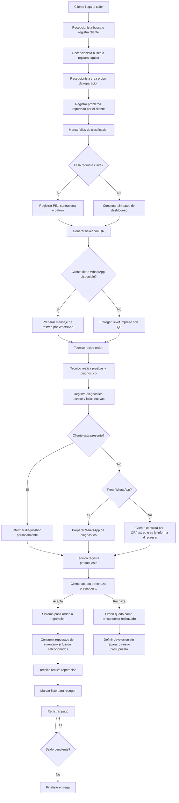

## Registro de cliente

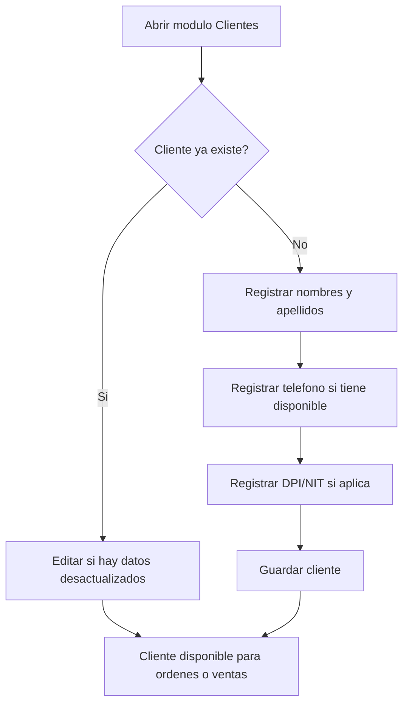

Reglas:

- El telefono puede quedar como no disponible si el equipo danado es el telefono personal del cliente.
- Los textos se normalizan a mayusculas.
- DPI y NIT ayudan a evitar duplicados.

## Registro de equipo

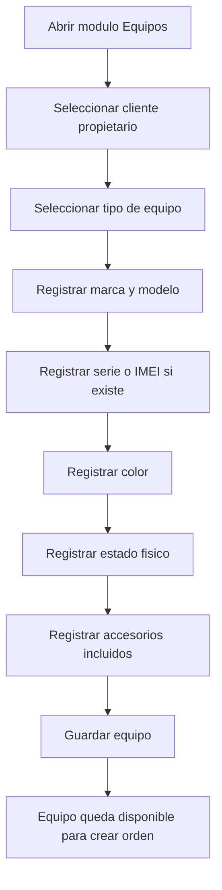

Reglas:

- Estado fisico y accesorios deben registrarse al recibir el equipo.
- Esto evita reclamos posteriores.

## Creacion de orden

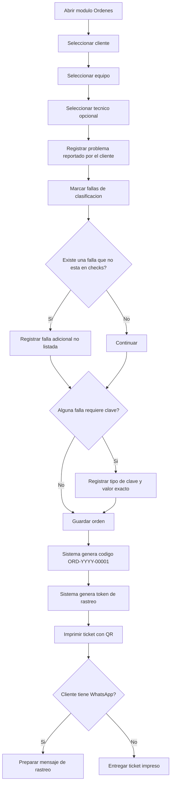

Campos clave:

- Problema reportado: relato libre del cliente.
- Fallas: clasificacion rapida mediante checks.
- Falla adicional: cuando la falla no esta en la lista.
- Datos de desbloqueo: solo cuando la revision lo necesita.

## Registro de datos de desbloqueo

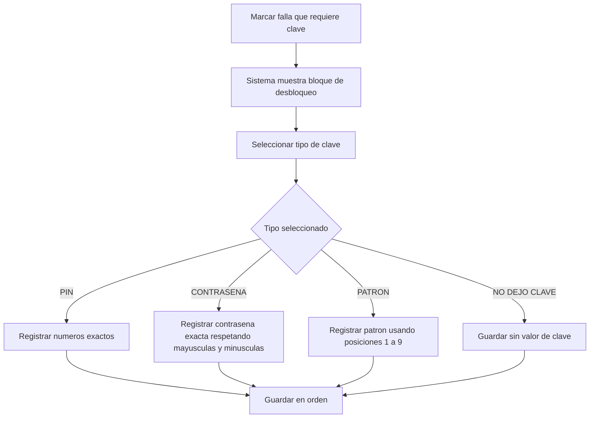

Referencia para patron:

```text
1 2 3
4 5 6
7 8 9
```

Ejemplo:

`1-2-5-9`

Nota:

- La clave exacta no se normaliza a mayusculas porque una contrasena puede depender de mayusculas y minusculas.

## Ticket con QR y rastreo publico

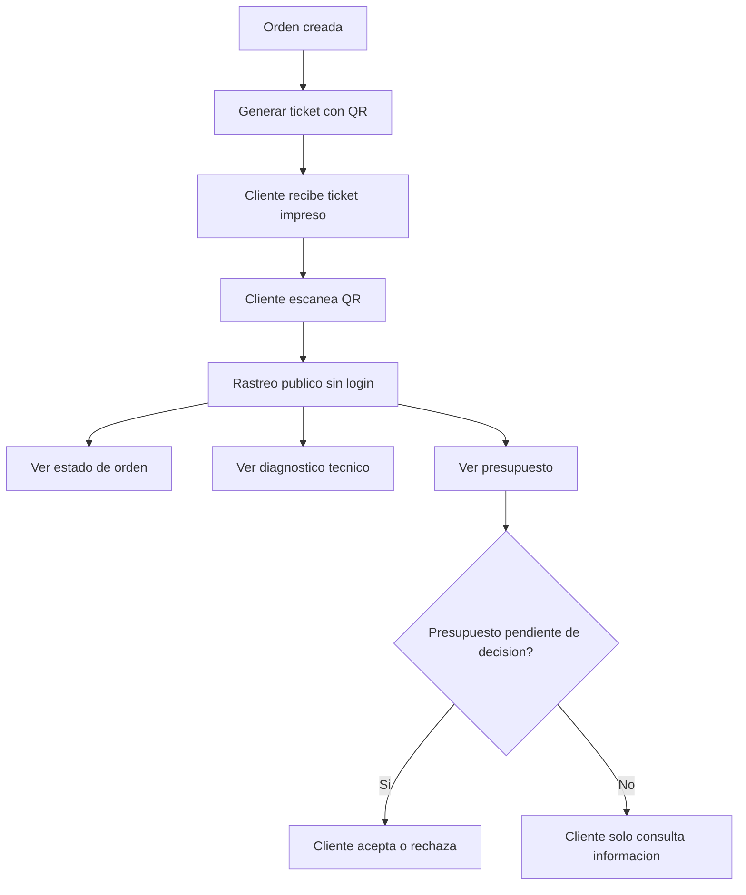

El ticket incluye:

- Codigo de orden.
- Datos del cliente.
- Datos del equipo.
- Problema reportado.
- Fallas marcadas.
- Falla adicional.
- Diagnostico.
- Datos de desbloqueo.
- QR de rastreo.
- Terminos y firmas.

## Diagnostico tecnico

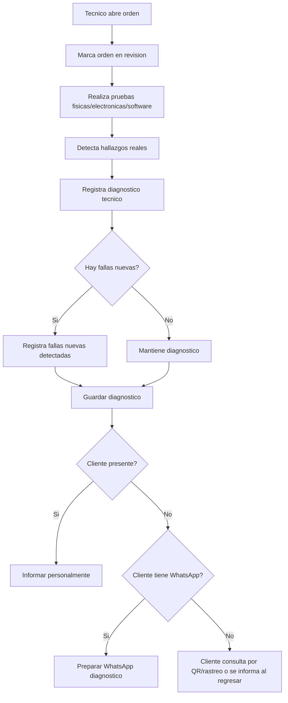

Ejemplo operativo:

- Cliente reporta: `SE MOJO, NO CARGA, NO ENCIENDE`.
- Tecnico prueba carga y logra encenderlo.
- Luego detecta: `HUMEDAD DANO PANTALLA`.
- Se registra diagnostico y se informa al cliente antes de presupuestar o continuar.

## Presupuesto tecnico

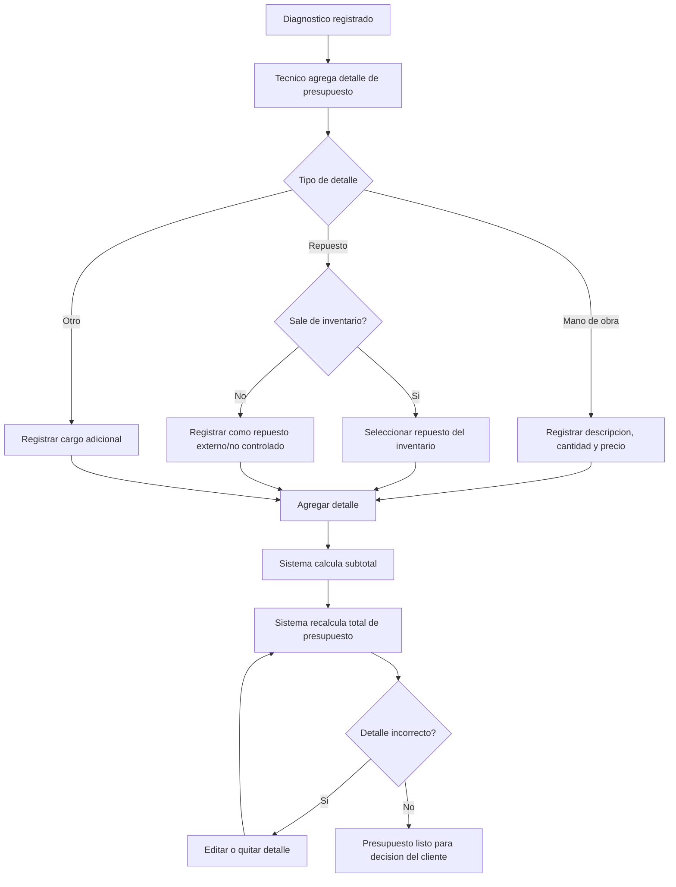

Reglas:

- No se aprueba presupuesto sin detalles.
- Se puede editar o quitar detalles antes del consumo de inventario.
- Al modificar presupuesto, la aprobacion vuelve a pendiente.

## Aceptacion o rechazo del presupuesto

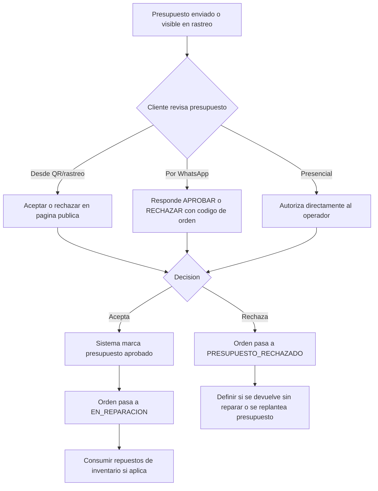

Mensaje sugerido por WhatsApp:

```text
APROBAR ORD-2026-00001
RECHAZAR ORD-2026-00001
```

Nota:

- El sistema no lee automaticamente WhatsApp. El operador debe registrar manualmente la decision si el cliente responde por chat.

## Reparacion y consumo de inventario

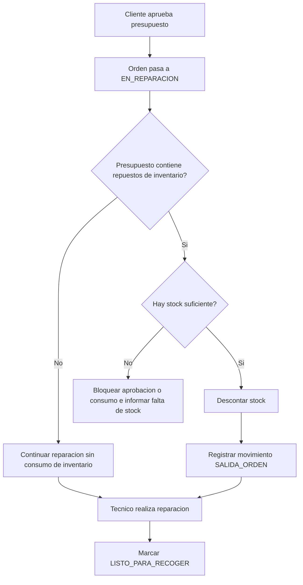

Reglas:

- Cotizar no descuenta stock.
- Aprobar presupuesto descuenta stock si el repuesto fue seleccionado desde inventario.
- Repuesto externo/no controlado no descuenta stock.

## Registro de pagos y finalizacion

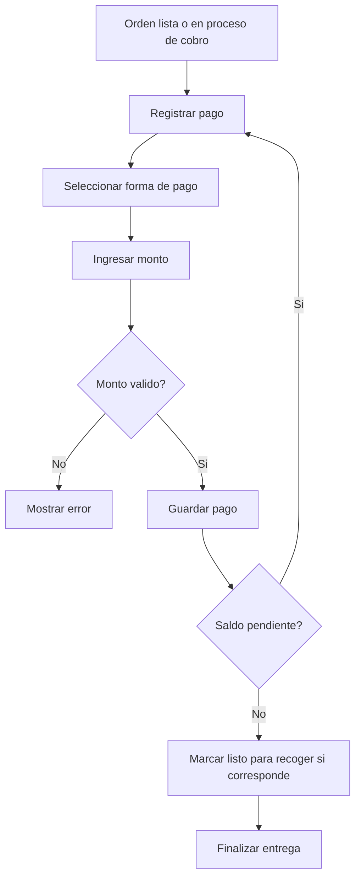

Reglas:

- No se aceptan pagos en cero.
- No se permite pagar mas del saldo pendiente.
- No se finaliza orden con saldo pendiente.

## Venta directa de inventario

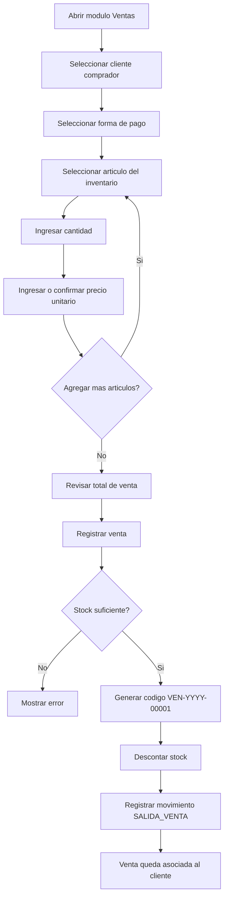

Reglas:

- La venta directa no se registra desde Inventario.
- Inventario administra articulos.
- Ventas registra salida comercial asociada a cliente.

## Administracion de inventario

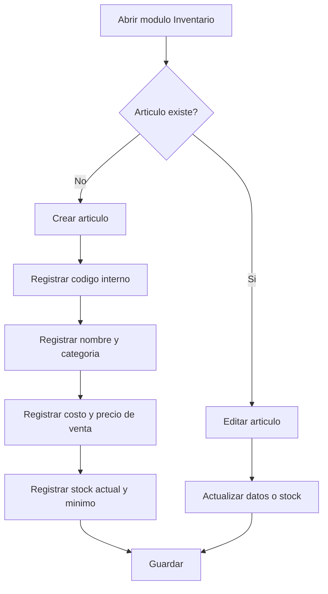

## Comunicacion con cliente

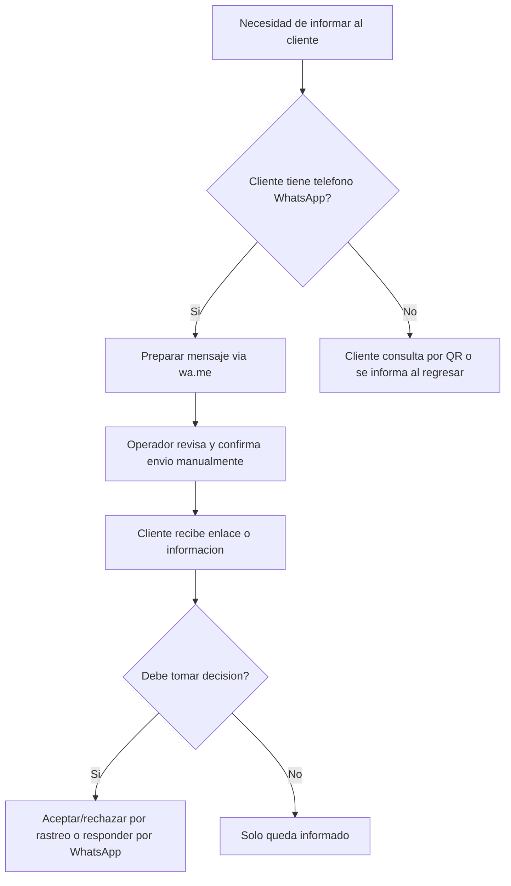

Casos de comunicacion:

- Registro de orden.
- Diagnostico tecnico.
- Presupuesto.
- Orden lista para recoger.

## Normalizacion de datos

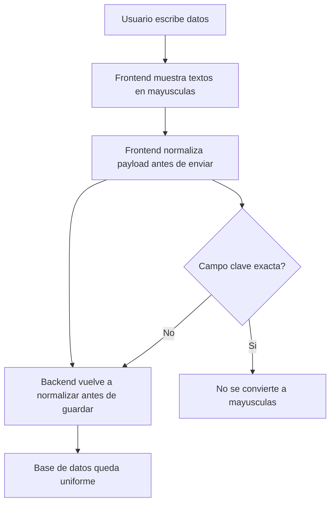

Excepcion:

- Valor exacto de PIN/contrasena/patron (`unlockCredentialValue`) no se transforma, porque una contrasena puede mezclar mayusculas y minusculas.

## Flujo de estados de orden

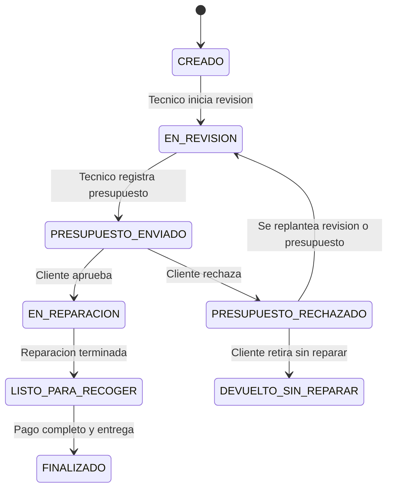

## Resumen de responsabilidades por rol

| Procedimiento | ADMIN | RECEPCIONISTA | TECNICO | CLIENTE |
|---|---:|---:|---:|---:|
| Iniciar sesion | Si | Si | Si | No |
| Registrar cliente | Si | Si | No | No |
| Registrar equipo | Si | Si | No | No |
| Crear orden | Si | Si | Puede apoyar | No |
| Imprimir ticket QR | Si | Si | No | Recibe |
| Registrar diagnostico | Si | No recomendado | Si | No |
| Registrar presupuesto | Si | No recomendado | Si | No |
| Aceptar/rechazar presupuesto | Manual | Manual | No | Si |
| Registrar pago | Si | Si | No | Paga |
| Registrar venta directa | Si | Si | No | Compra |
| Administrar inventario | Si | Segun politica | Segun politica | No |
| Finalizar entrega | Si | Si | No | Recibe equipo |

## Procedimientos pendientes por definir

- Permisos estrictos por rol.
- Catalogo editable de fallas.
- Comprobante de venta directa.
- Garantias de reparacion.
- Firma digital o constancia de entrega.
- Reporte de ingresos por orden y ventas.
- Reporte de movimientos de inventario.
- Auditoria detallada de cambios por usuario.
